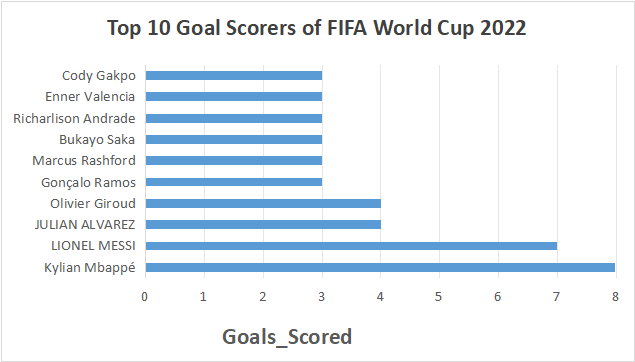
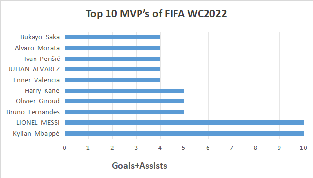
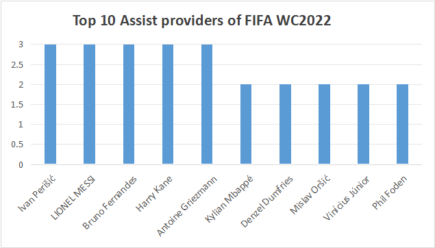
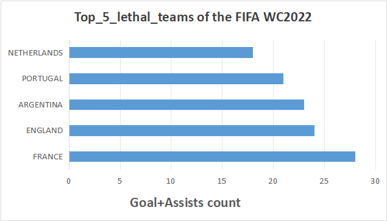
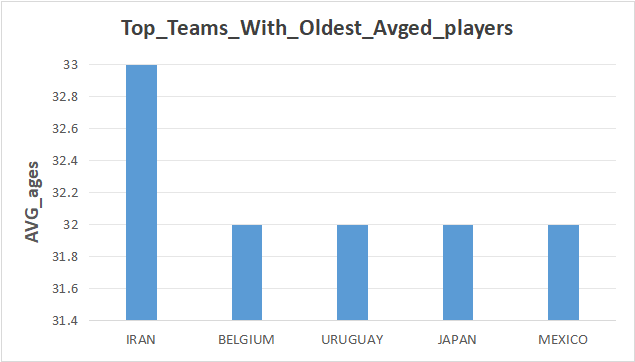
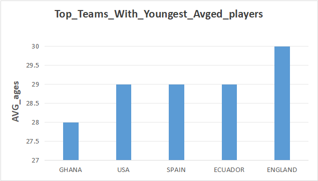
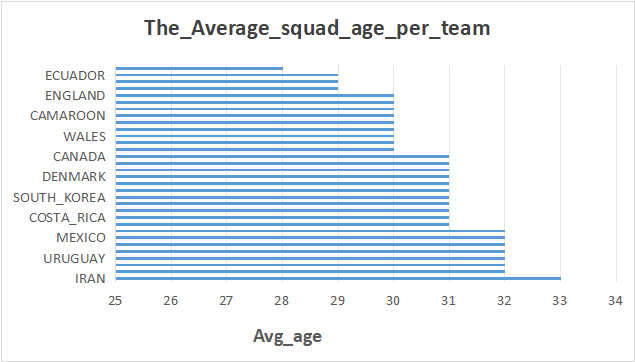

# **SQL Project: FIFA World_Cup 2022 Database and Insights** #

## Project Overview ##
This project analyzes the World Cup FIFA World Cup 2022 and it’s various insights. This project demonstrates, firstly, how I made the World Cup database and inserted player data from 32 teams into 32 tables, how I  attached unique team_IDs, and player_IDs to create Table_players and Table_teams with team_ID and player_ID as the primary keys.Secodly this project demonstrates (After the database completion) some interesting insights of the FIFA World Cup 2022 such as: 

1.Top 10 goal scorer : [Top_10_Goal_scorer](https://github.com/mohammedsayemqazi-byte/WC_database/blob/main/Top_10_Goal_scorer)

2.Top 10 MVP : [Top_10_MVP](https://github.com/mohammedsayemqazi-byte/WC_database/blob/main/Top_10_MVP)

3.Top 10 assists : [Top_10_Assist](https://github.com/mohammedsayemqazi-byte/WC_database/blob/main/Top_10_Assist)

4.Top five lethal teams : [Top_5_lethal_teams](https://github.com/mohammedsayemqazi-byte/WC_database/blob/main/Top_5_lethal_teams)

5.Top five oldest and youngest team  : [top_5_Oldest_and_youngest_teams](https://github.com/mohammedsayemqazi-byte/WC_database/blob/main/top_5_Oldest_and_youngest_teams)

6.The average squad age per team : [Average_squad_age_per_team](https://github.com/mohammedsayemqazi-byte/WC_database/blob/main/Average_squad_age_per_team)


## Key Questions Answered ##
1.Who were the Top 10 goal scorer ?
2.Who were the Top 10 MVP's of the tournamnet?
3.Who were the Top 10 assist providers ?
4.Who were the Top five most lethal teams ?
5.Top five oldest and youngest team &
6.The average squad age per team


## Technologies Used ##
#### Database: PostgreSQL ####
#### Tools: pgAdmin, VS Code ####
#### Language: SQL ####

## Tools Description (Details) ##
**SQL** : Enabled me to create database, join, aggregate, and rank the fifa wold cup 2022 data to answer all 6  questions.

**PostgreSQL** : Provided a reliable and scalable database environment that handled complex joins and aggregations across hundreds of records efficiently.

**Visual Studio Code** : Helped to streamline the writing, testing, and formatting of SQL scripts with extensions that connect directly to the database.

**Git & GitHub** : tracked every version of my work and made the complete project shareable and reproducible via a public repository.

# Part 1: The database build-up #
## 1. Creating the 32 tables ##
I created the 32 tables using the same query of "create table .... then I input columns of my choice with appropriate data types such as b_date = date, jersey_no = INT etc.

**Example of Table_ARGENTINA is shown below**
```sql
-- Argentina
CREATE TABLE ARGENTINA (
    JERSEY_NO INT NOT NULL,
    F_NAME VARCHAR(20),
    L_NAME VARCHAR(20),
    B_DATE DATE,
    GOALS_SCORED INT,
    ASSISTS INT,
    PRIMARY KEY (JERSEY_NO)
);
```
Using the exact same query and with different table names for all of the other teams I made 31 more tables.

## 2.Inserting Value into 32 tables ##
I used the same "Insert into (table_name(jersey_no,f_name,...))" query for each of 32 teams. 
**Example of Table_ARGENTINA is shown below**
```sql
-- ARGENTINA
INSERT INTO ARGENTINA (JERSEY_NO, F_NAME, L_NAME, B_DATE, GOALS_SCORED, ASSISTS)
VALUES
(1, 'FRANCO', 'ARMANI', '1986-10-16', 0, 0),
(12, 'GERONIMO', 'RULLI', '1992-05-20', 0, 0),
(23, 'EMILIANO', 'MARTINEZ', '1992-09-02', 0, 0),
(2, 'JUAN', 'FOYTH', '1998-01-12', 0, 0),
(3, 'NICOLAS', 'TAGLIAFICO', '1992-08-31', 0, 0),
(4, 'GONZALO', 'MONTIEL', '1997-01-01', 0, 0),
(6, 'GERMAN', 'PEZZELLA', '1991-06-27', 0, 0),
(8, 'MARCOS', 'ACUNA', '1991-10-28', 0, 0),
(13, 'CRISTIAN', 'ROMERO', '1998-04-27', 0, 0),
(19, 'NICOLAS', 'OTAMENDI', '1988-02-12', 0, 0),
(25, 'LISANDRO', 'MARTINEZ', '1998-01-18', 0, 0),
(26, 'NAHUEL', 'MOLINA', '1998-04-06', 1, 1),
(5, 'LEANDRO', 'PAREDES', '1994-06-29', 0, 0),
(7, 'RODRIGO', 'DE PAUL', '1994-05-24', 0, 0),
(14, 'EXEQUIEL', 'PALACIOS', '1998-10-05', 0, 0),
(17, 'ALEJANDRO', 'GÓMEZ', '1988-02-15', 0, 0),
(18, 'GUIDO', 'RODRIGUEZ', '1994-04-12', 0, 0),
(20, 'ALEXIS', 'MAC ALLISTER', '1998-12-24', 1, 1),
(24, 'ENZO', 'FERNANDEZ', '2001-01-17', 1, 0),
(9, 'JULIAN', 'ALVAREZ', '2000-01-31', 4, 0),
(10, 'LIONEL', 'MESSI', '1987-06-24', 7, 3),
(11, 'ANGEL', 'DI MARIA', '1988-02-14', 1, 0),
(15, 'NICOLAS', 'GONZALEZ', '1998-04-06', 0, 0),
(16, 'JOAQUIN', 'CORREA', '1994-08-13', 0, 0),
(21, 'PAULO', 'DYBALA', '1993-11-15', 0, 0),
(22, 'LAUTARO', 'MARTINEZ', '1997-08-22', 0, 0);
```
Using the exact same query and with different appropriate values for all of the other teams I made 31 more tables.
#### **NOTE:** The source for the values were from FIFA's Webssite and other online sources ###


## 3.Adding unique Team_ids into 32 tables ##
Next, I wanted to create two Tables so that I can perform SUB-Queries and show interesting Comparisons and insights. These were table_Teams and table_players. To do so I added unique team ideas to table_teams and table_players. I added the unique team IDs to all 32 tables by using the "Alter table (table_name) ADD column (team_id)", and Then "update (team_name), Set (team_ID) = (unique_ID: 1 to 32)" for each of 32 teams.
#### **The Query:** ####
```sql
ALTER TABLE ARGENTINA    ADD COLUMN team_id INT;
ALTER TABLE AUSTRALIA     ADD COLUMN team_id INT;
ALTER TABLE BELGIUM      ADD COLUMN team_id INT;
ALTER TABLE BRAZIL       ADD COLUMN team_id INT;
ALTER TABLE CAMAROON     ADD COLUMN team_id INT;
ALTER TABLE CANADA       ADD COLUMN team_id INT;
ALTER TABLE COSTA_RICA   ADD COLUMN team_id INT;
ALTER TABLE CROATIA      ADD COLUMN team_id INT;
ALTER TABLE DENMARK      ADD COLUMN team_id INT;
ALTER TABLE ECUADOR      ADD COLUMN team_id INT;
ALTER TABLE ENGLAND      ADD COLUMN team_id INT;
ALTER TABLE FRANCE       ADD COLUMN team_id INT;
ALTER TABLE GERMANY      ADD COLUMN team_id INT;
ALTER TABLE GHANA        ADD COLUMN team_id INT;
ALTER TABLE IRAN         ADD COLUMN team_id INT;
ALTER TABLE JAPAN        ADD COLUMN team_id INT;
ALTER TABLE MEXICO       ADD COLUMN team_id INT;
ALTER TABLE MOROCCO      ADD COLUMN team_id INT;
ALTER TABLE NETHERLANDS  ADD COLUMN team_id INT;
ALTER TABLE POLAND       ADD COLUMN team_id INT;
ALTER TABLE PORTUGAL     ADD COLUMN team_id INT;
ALTER TABLE QATAR        ADD COLUMN team_id INT;
ALTER TABLE SAUDI_ARABIA ADD COLUMN team_id INT;
ALTER TABLE SENEGAL      ADD COLUMN team_id INT;
ALTER TABLE SERBIA       ADD COLUMN team_id INT;
ALTER TABLE SOUTH_KOREA  ADD COLUMN team_id INT;
ALTER TABLE SPAIN        ADD COLUMN team_id INT;
ALTER TABLE SWITZERLAND  ADD COLUMN team_id INT;
ALTER TABLE TUNISIA      ADD COLUMN team_id INT;
ALTER TABLE URUGUAY      ADD COLUMN team_id INT;
ALTER TABLE USA          ADD COLUMN team_id INT;
ALTER TABLE WALES        ADD COLUMN team_id INT;

-- ============================================================
-- 2. UPDATE: Set the unique team_id for each table
-- ============================================================
UPDATE ARGENTINA    SET team_id = 1;
UPDATE AUSTRALIA     SET team_id = 2;
UPDATE BELGIUM      SET team_id = 3;
UPDATE BRAZIL       SET team_id = 4;
UPDATE CAMAROON     SET team_id = 5;
UPDATE CANADA       SET team_id = 6;
UPDATE COSTA_RICA   SET team_id = 7;
UPDATE CROATIA      SET team_id = 8;
UPDATE DENMARK      SET team_id = 9;
UPDATE ECUADOR      SET team_id = 10;
UPDATE ENGLAND      SET team_id = 11;
UPDATE FRANCE       SET team_id = 12;
UPDATE GERMANY      SET team_id = 13;
UPDATE GHANA        SET team_id = 14;
UPDATE IRAN         SET team_id = 15;
UPDATE JAPAN        SET team_id = 16;
UPDATE MEXICO       SET team_id = 17;
UPDATE MOROCCO      SET team_id = 18;
UPDATE NETHERLANDS  SET team_id = 19;
UPDATE POLAND       SET team_id = 20;
UPDATE PORTUGAL     SET team_id = 21;
UPDATE QATAR        SET team_id = 22;
UPDATE SAUDI_ARABIA SET team_id = 23;
UPDATE SENEGAL      SET team_id = 24;
UPDATE SERBIA       SET team_id = 25;
UPDATE SOUTH_KOREA  SET team_id = 26;
UPDATE SPAIN        SET team_id = 27;
UPDATE SWITZERLAND  SET team_id = 28;
UPDATE TUNISIA      SET team_id = 29;
UPDATE URUGUAY      SET team_id = 30;
UPDATE USA          SET team_id = 31;
UPDATE WALES        SET team_id = 32;
```
## 4.Creating table_teams & table_players to make joins ##
 I created table_teams using the "create table" query containing columns "Team_ID" as primary key NOT NULL and "team name". I used the "Insert into table (table_name), values((1,'ARGENTINA'),(2.'AUSTRALIA'),(...))" query to add values to each teams.

 #### **The Query:** ####
```sql
CREATE TABLE teams (
    team_id SERIAL PRIMARY KEY,
    team_name VARCHAR(30) UNIQUE NOT NULL
);

INSERT INTO teams (team_id, team_name) VALUES
(1,  'ARGENTINA'),
(2,  'AUSTRALIA'),    
(3,  'BELGIUM'),
(4,  'BRAZIL'),
(5,  'CAMAROON'),
(6,  'CANADA'),
(7,  'COSTA_RICA'),
(8,  'CROATIA'),
(9,  'DENMARK'),
(10, 'ECUADOR'),
(11, 'ENGLAND'),
(12, 'FRANCE'),
(13, 'GERMANY'),
(14, 'GHANA'),
(15, 'IRAN'),
(16, 'JAPAN'),
(17, 'MEXICO'),
(18, 'MOROCCO'),
(19, 'NETHERLANDS'),
(20, 'POLAND'),
(21, 'PORTUGAL'),
(22, 'QATAR'),
(23, 'SAUDI_ARABIA'),
(24, 'SENEGAL'),
(25, 'SERBIA'),
(26, 'SOUTH_KOREA'),
(27, 'SPAIN'),
(28, 'SWITZERLAND'),
(29, 'TUNISIA'),
(30, 'URUGUAY'),
(31, 'USA'),
(32, 'WALES');
```

## 4.Creating  table_players to make joins #### 
Finally, I created the table_players where I used "create table players" query, and then **"insert values into table players" query selecting values from the 32 team tables** and **selecting team_id from table_teams** created before. **Here the team_id is SECONDARY key referncing teams.team_id  and unique player_ID, the primary key for each players.**

**Example of Table_players using data from table 'ARGENTINA' is shown below**
#### **The Query** ####
```sql
CREATE TABLE players (
    player_id SERIAL PRIMARY KEY,
    team_id INT REFERENCES teams(team_id),
    jersey_no INT NOT NULL,
    f_name VARCHAR(20),
    l_name VARCHAR(20),
    b_date DATE,
    goals_scored INT DEFAULT 0,
    assists INT DEFAULT 0,
    UNIQUE (team_id, jersey_no)
);

-- ARGENTINA
INSERT INTO players (team_id, jersey_no, f_name, l_name, b_date, goals_scored, assists)
SELECT (SELECT team_id FROM teams WHERE team_name = 'ARGENTINA'),
       jersey_no, f_name, l_name, b_date, goals_scored, assists
FROM ARGENTINA;
```


# **Part 2 : Analysis & Results** #
## 1. Top 10 Goal Scorers ##
 
 To identify which players scored the highest amount of goals throughout the tournament from the data set, I joined the table_teams and table_players table on team ID being the primary key for the table teams and the secondary key for the table players. I ordered the list of top scorers by goals_scored which I named as goals_count.

 #### **The Query:** ####
``` sql
select 
    concat(f_name, ' ',  l_name) as Player_name,
    player_id, 
    team_name,
    goals_scored as goals_count

FROM players as P
Inner JOIN teams as T
On P.team_id=T.team_id

order by  
    goals_count desc
Limit 10;

-- Kylian Mbaape is the topscorer of FIFA WC2022

```
#### **Breakdown of the top 10 goal scorers of the FIFA World Cup 2022:** ####

Kylian Mbappé was the top scorer with eight goals followed by Lionel Messi with seven goals. The third position belong to Julian Alvarez and Oliver Giro both with four goals each multiply players called three goals Gonzalo Ramos from Portugal, Marcus Rashford from England, Buka, Secha from England from Brazil Valencia from Ecuador and Cody and Cody Gapo from Netherlands




**Figure :** Made using Insert > Chart > Bar Chart from Microsoft Excel.

## 2. Top_10_MVP  ##
 
 To identify which players were the MVP's of the tournament from the data set, I first made a temporary table of table_teams, CTE named top_players then inner joined it with the table_players table on team ID being the primary key for the table teams and the secondary key for the table players. I ordered the list of top scorers by Sum of goals_scored + Assists which I named as mvp.

 #### **The Query:** ####
``` sql
With top_players as (
select teams.team_id,team_name From teams
)

Select top_players.*,
   concat(f_name,'  ',l_name) as player_name,
    sum(GOALS_SCORED+ASSISTS) as mvp
FROM 
    players
 Inner join 
        top_players
ON
    players.team_id=top_players.team_id
 group by player_name,top_players.team_id,top_players.team_name
 order by mvp desc
 Limit 10;

 -- Kylian Mbappe from France & Lionel Messi from Argentina were the MVP's

```
#### **Breakdown of the top_10_MVP of the FIFA World Cup 2022:** ####

Kylian Mbappé and Lionel Messi had the highest total goals+assists with s10 each. Bruno Fernandez, Oliver Giroud, and Harry Kane Each had five total goals plus assist. Followed by inner Valencia, Julian Alvarez , Ivan Perisic, Alvaro Morata and Bukayo saka had four total goals plus assists each had four




**Figure :** Made using Insert > Chart > Bar Chart from Microsoft Excel.

## 3. Top_10_Assist_providers  ##
 
To identify which players had the highest assist throughout the tournament, I again joined table_players and table_teams on team _ID being the primary key for table,_teams and secondary ID for table players

 #### **The Query:** ####
``` sql
select 
    player_id,
    concat(f_name,' ',l_name) as Player_name,
    teams.team_name,
    assists 
From 
    players
Inner join 
    teams 
ON players.team_id=teams.team_id
ORDER BY
    assists DESC
Limit 10;

```
#### **Breakdown of the top 10 Assist providers of the FIFA World Cup 2022:** ####

Ivan Perisic, Lionel Messi, Bruno, Fernandes, Harry Kane and Antoine Griezmann all had three assists each throughout the tournament and at the highest assist providers of the FIFA World Cup 2022.



**Figure :** Made using Insert > Chart > Column Chart from Microsoft Excel.

## 4.Top_5_Lethal teams ##
To find out the top five mostly teams of the FIFA World Cup 2022 I calculated the sum of goals called some of assist and the total goals called plus assist as GA count. I then inner Joined table players with table teams on Team ID.

#### **The Query:** ####
``` sql
Select
    team_name,
    sum(GOALS_SCORED) as goals_count,
    sum(assists) as assists_count,
    sum(goals_scored + assists) as GA_count
From 
    players
Inner Join teams 
ON players.team_id=teams.team_id
group by team_name
order by GA_count desc
Limit 5;
```


#### **Breakdown of the top_5_lethal_teams of the FIFA World Cup 2022:** ####

The bar Graph shows an interesting insight, even though Argentina won the FIFA World Cup 2022, but France and England were more lethal than Argentina. The order follows as France as the most lethal then England followed by Argentina then Portugal, lastly Netherlands. Lethality was calculated based on summation of goals_scored and assists by each teams.



**Figure :** Made using Insert > Chart > Bar Chart from Microsoft Excel.

## 5. Top five oldest and youngest team   ##

To find out the top five teams with oldest average age of players I found the difference between the current date and their birthdate, and ordered the age in a descending order. Conversely, to find out the top five teams, with the youngest average age of players, I found the same difference between the current age and the birthdates of the players , but this time ordered the difference in ascending order.

#### **The Query for teams with oldest average age of players :** ####

``` sql

-- Top 5 teams with oldest average age of players
SELECT 
    team_name,
    count(player_id) as total_players,
   Round(avg(extract (year from Age(current_date,b_date))),0) as avg_age
from 
    players
INNER JOIN
    teams
ON
    players.team_id = teams.team_id
GROUP BY
    team_name
ORDER BY
    avg_age DESC
Limit 5;
```
#### **The Query for teams with Youngest average age of players :** ####

```sql 
-- Top 5 teams with youngest average age of players
SELECT 
    team_name,
    count(player_id) as total_players,
   Round(avg(extract (year from Age(current_date,b_date))),0) as avg_age
from 
    players
INNER JOIN
    teams
ON
    players.team_id = teams.team_id
GROUP BY
    team_name
ORDER BY
    avg_age ASC
Limit 5;

```




#### **Breakdown of the Top five oldest and youngest team  of the FIFA World Cup 2022:** ####

Iran had the squad with the oldest average aged players of age 33, Whereas Ghana had the squad with the youngest average aged players of age 27.


**Figure :** Both figures Made using Insert > Chart > Column Chart from Microsoft Excel.


## 6.The_Average_squad_age_per_team ##
To find out the Average squad age per team of the FIFA World Cup 2022 I calculated the difference between the current date and the birthdate of the players from each team and then I found the average of this difference. Additionally, I had to inner John table_players with table_teams on team_ID as the primary key For table_teams and secondary key for the Table_players. 


#### **The Query:** ####
``` sql
select 
    teams.team_name,
    Round(avg(EXTRACT(year from age(current_date,b_date))),0) as avg_squad_Age
From 
    players
Inner join 
    Teams 
On 
    players.team_id=teams.team_id
Group BY 
    teams.team_name
ORDER BY 
     avg_squad_age desc ;
```


#### **Breakdown of The_Average_squad_age_per_team of the FIFA World Cup 2022:** ####

The Bar graph illustrates that the average age of all the teams are from 28 years to 33 years, Ecuador has the youngest squad with average age of team being 28 years old only, while Iran has the oldest average aged squad age of 33 years.



**Figure :** Made using Insert > Chart > Bar Chart from Microsoft Excel.

## 📖 What I Learned from This Project ##
* #### **Centralized vs. Fragmented Schemas :** ####
Converting 32 individual country tables into a normalized teams + players structure dramatically simplified global queries (e.g., Top 10 scorers) and eliminated redundant schema management.

* #### **Real-World Data Cleaning is Half the Battle** ####
I identified and fixed duplicate players (e.g., Christian Eriksen appeared twice), missing last names (Pepe, Vitinha), and syntax errors (smart quotes) – teaching me that data quality is non-negotiable before any analysis.

* #### **Advanced SQL = Simple Insights** ####
Mastering CTEs, AGE() date calculations, and aggregated SUM() expressions allowed me to transform raw stats (goals, assists) into meaningful metrics like MVP scores and squad age profiles.

## 🏁 Conclusion ##
* #### **Team Depth Outshines Individual Brilliance:** ####
While Messi and Mbappé topped the MVP charts, teams like England and France had 8+ different goal-scorers, proving that collective firepower matters more than relying on one superstar.

* #### **Age is a Trade-off, Not a Disadvantage** ####
The youngest teams (USA, Ghana) brought energy, while the oldest (Uruguay, Belgium) brought experience – but the finalists (Argentina, France) struck a balanced middle ground that combined both.

* #### **Assist Providers are the Invisible Game-Changers** ####
Players like Bruno Fernandes and Griezmann may not have led in goals, but their assist numbers directly boosted their team's lethality – showing that creation is equally as valuable as finishing.

## 💭 Closing Thoughts ##
* #### **This is a Foundation, Not a Finish Line:** ####
Adding tables for matches, minutes_played, or tackles would unlock advanced analytics like xG or efficiency per 90 minutes – taking the project to the next level.

* #### **PostgreSQL is My Database of Choice:** ####
Its powerful date functions, window operations, and JOIN performance made handling 830+ player records seamless – a tool I'd confidently use for future analytics projects.

* #### **Sports Analytics is a Treasure Trove of Insights:** ####
This project proved that every pass, shot, and assist tells a story – and with SQL, anyone can sit in the data-driven director's seat. The questions are endless; I'm just getting started.
